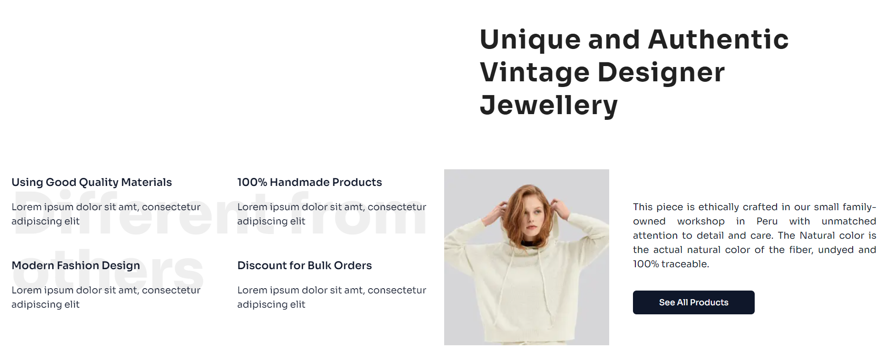
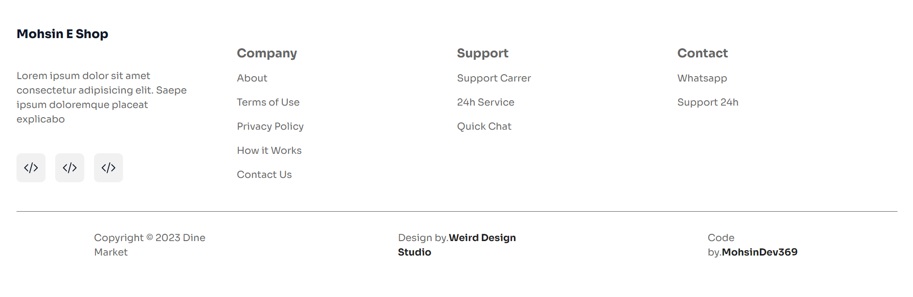

# Getting Started
* Install Project Dependencies
  ```sh
  npm install
  ```
  
* Run Locally
  ```sh
  npm run dev
  ```

Open [http://localhost:3000](http://localhost:3000) with your browser to see the result.

You can start editing the page by modifying `app/page.tsx`. The page auto-updates as you edit the file.

your feedback and contributions are welcome!
## Desktop Preview





